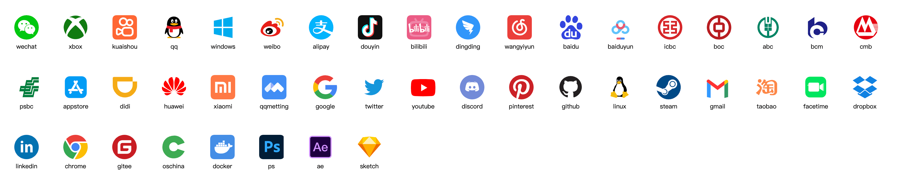

<p align="center">
  
</p>

<h1 align="center">React Common Icons</h1>

## Installation

```
npm install react-common-icons
```

or

```
yarn add react-common-icons
```

## Usage

```js
import React from 'react'
import { render } from "react-dom";
import Icon from "react-common-icons";

function App() {
  return (
    <div id="app">
      <Icon name="youtube" size={30} />
    </div>
  );
}

render(<App />, document.getElementById("app"));
```
## Preview Icons

[View All Icons](https://react-common-icons.vercel.app)



## Welcome PR

If you need some icons, welcome PR
## License

[MIT](https://github.com/ruilisi/react-common-icons/blob/master/LICENSE.md)
